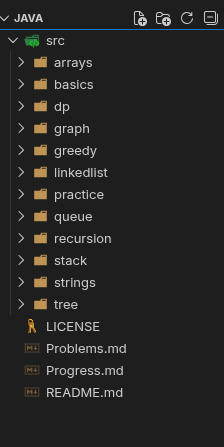

# 📘 Java DSA Practice (LeetCode + Core Concepts)


This repository contains my **Data Structures & Algorithms (DSA)** practice using **Java**, focused on **LeetCode basics → advanced**, written in a **clean, interview-oriented style**.

The goal of this repo is to:

* Build strong DSA fundamentals
* Practice problem-solving in Java
* Prepare for coding interviews

---

## 🛠️ Tech Stack

* **Language:** Java (OpenJDK 21)
* **Editor:** VS Code
* **Platform:** LeetCode
* **Approach:** Brute Force → Optimized

---

## 📁 Folder Structure




### 📌 Folder Purpose


| Folder | Description |
|------|-------------|
| arrays | Array-based DSA problems (hashing, two pointers, Kadane, greedy basics) |
| basics | Java fundamentals required for DSA (loops, conditions, arrays, OOP basics) |
| dp | Dynamic Programming problems (memoization, tabulation, space optimization) |
| graph | Graph algorithms (BFS, DFS, shortest path, connected components) |
| greedy | Greedy algorithm problems and optimization strategies |
| interviewquestions | Frequently asked interview questions with explanations & solutions |
| linkedlist | Singly & doubly linked list problems (pointer manipulation, cycles) |
| notes | Concept notes, week-wise study material, and revision documentation |
| practice | Mixed practice problems and revision-level questions |
| queue | Queue & deque problems (BFS, sliding window, circular queue) |
| quiz | Self-test quizzes for DSA concepts and patterns |
| recursion | Recursion and backtracking problems (base case → recursion tree) |
| stack | Stack-based problems (LIFO, monotonic stack, expressions) |
| strike | Daily streak / challenge-based problems (consistency tracking) |
| strings | String manipulation problems (frequency, hashing, sliding window) |
| tree | Binary Tree & BST problems (DFS, BFS, recursion-based traversal) |

---

## 📄 Root Files

| File | Description |
|-----|-------------|
| README.md | Project overview, roadmap, and folder explanation |
| Problems.md | Complete list of solved LeetCode problems |
| Progress.md | Week-wise learning & problem-solving progress |
| LICENSE | Open-source license for the repository |
| image.png | Visual asset used in README or documentation |

---

## 📌 Notes
- Folder structure follows a **pattern-first DSA roadmap**
- Problems are organized from **easy → medium → hard**
- Designed for **interview preparation + clean GitHub presentation**
- Easily scalable as new topics and problems are added

---

## 🧠 Coding Rules Followed

* One problem = one `.java` file
* Class name = file name
* No unnecessary OOP
* Static methods only
* `main()` used only for testing
* Clear comments for approach & complexity

Example:

```java
// Pattern: Hashing
// Time: O(n)
// Space: O(n)
```

---

## 🚀 How to Run Code (VS Code)

1. Open the `java` folder in VS Code
2. Make sure `src` is set as **source directory**
3. Open any `.java` file
4. Click ▶ **Run**

*No terminal commands needed.*

---

## 📌 Example Problem (Two Sum)

**Problem:**
Given an array of integers and a target, return indices of two numbers that add up to the target.

**Approach Used:**

* HashMap for O(n) solution
* One-pass traversal

---

## 🎯 Learning Roadmap

* 🔄 Java Basics
* 🔄 Arrays & Strings
* 🔄 Recursion
* 🔄 Linked List
* 🔄 Stack & Queue
* 🔄 Trees & Graphs
* 🔄 Dynamic Programming
* 🔄 Greedy Algorithms

---

## 🧩 Platform Reference

Problems are mainly taken from:

* LeetCode (Easy → Medium)

---

## 📈 Progress Tracking

This repository is updated regularly as I solve more problems and improve my understanding.

---

## ⭐ Why This Repo?

* Beginner-friendly Java DSA practice
* Clean, readable code
* Interview-focused solutions
* Step-by-step learning

---

## 📂 Additional Documentation

- 📋 **[PROBLEMS.md]** → List of LeetCode problems solved
- 📅 **[PROGRESS.md]** → Daily DSA progress tracker

---

## 👤 Author

**Pratik**  
Computer Science Student  
Java | DSA | Problem Solving


